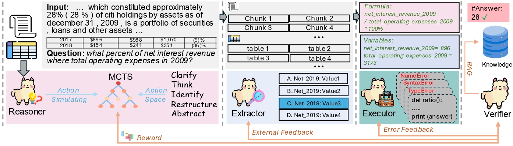

## [Overview](#)
Financial Question Answering (FQA) challenges large language models (LLMs) in domains requiring deep financial knowledge and numerical reasoning. Supervised fine-tuning (SFT) and closed-source LLMs help but have limits in flexibility and cost. We propose FARVE—Financial Agent-based Reasoning, Variable Extraction, and Execution—to enable smaller LLMs (e.g., Llama3-8B) to perform complex tasks without expensive models. FARVE breaks FQA into subquestions, applies step-wise verification for traceable outputs, and leverages a financial formula dataset. Evaluations show FARVE improves accuracy on benchmarks like ConvFinQA and TAT-QA, surpassing GPT-3.5 and GPT-4, while scaling through multi-agent interactions.



## [Prerequest](#)
```angular2html
vllm
autogen
```

## [Run Scripts](#)
make sure you serve a model before running the script
```angular2html
vllm serve meta-llama/Meta-Llama-3-8B-Instruct --port 8000
```
```angular2html
vllm serve meta-llama/CodeLlama-13b-Python-hf --port 8003
```
```angular2html
bash scripts/test.sh
```

